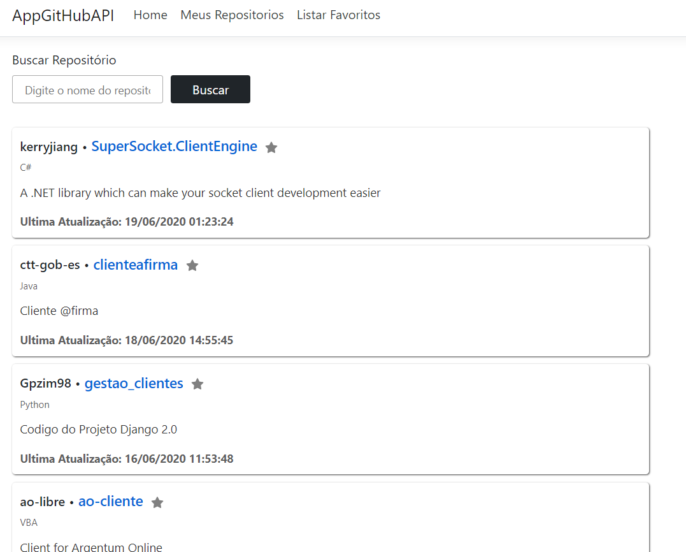
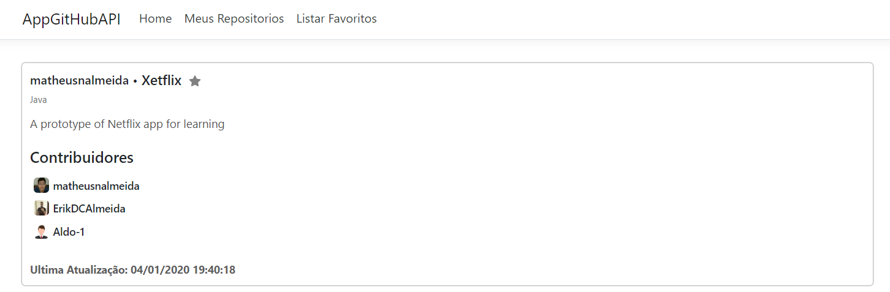
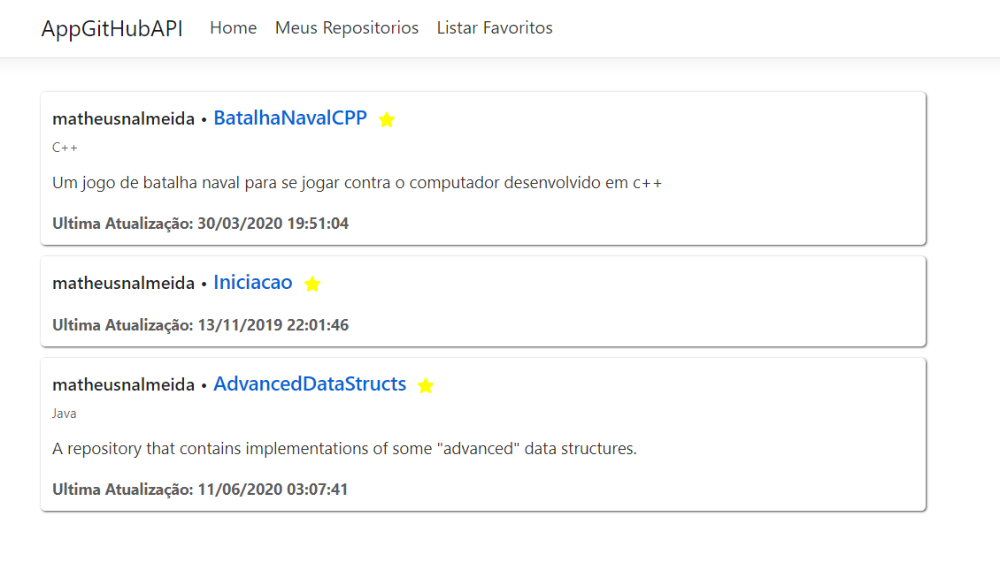
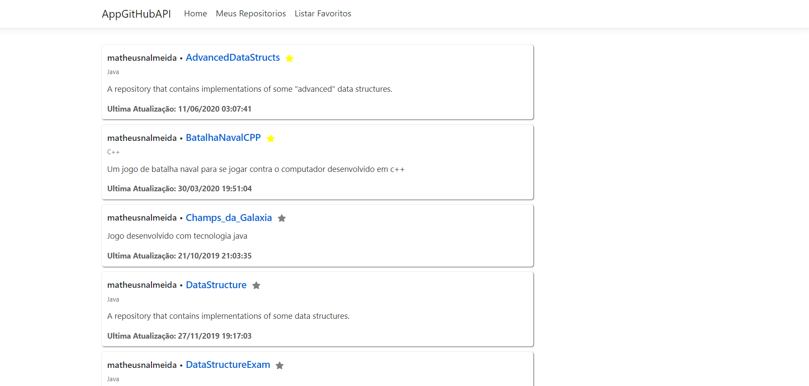

<h1 align="center">Welcome to GitHubAPI 👋</h1>

Tela de Busca              |  Tela de Detalhes
:-------------------------:|:-------------------------:
  |  

Tela de Favoritos           |  Tela de Meus Repositorios
:---------------------------:|:-------------------------:
  |  

<p>
  
  
  
  <a href="https://github.com/matheusnalmeida/GitHubAPI/#readmme#" target="_blank">
    
  </a>
  <a href="https://github.com/matheusnalmeida/GitHubAPI/graphs/commit-activity" target="_blank">
    
  </a>
  <a href="https://github.com/matheusnalmeida/GitHubAPI/blob/master/LICENSE" target="_blank">
    
  </a>
</p>

> Aplicação desenvolvida em C# para consulta da api do GitHub

### 🏠 [Pagina Inicial](https://github.com/matheusnalmeida/GitHubAPI)

## Pre Requisitos

- C#
- AspNet MVC

## Usabilidade

```sh
Pressionar f5 no visual studio
```

## Autor

👤 **Matheus Nunes De Almeida**

* GitHub: [@matheusnalmeida](https://github.com/matheusnalmeida)
* LinkedIn: [@https:\/\/www.linkedin.com\/in\/matheus-nunes-de-almeida-387980194\/](https://www.linkedin.com/in/matheus-nunes-de-almeida-387980194/)

## Demonstre seu suporte

De uma ⭐️ se este projeto te ajudou!

## 📝 Licença

Copyright © 2020 [Matheus Nunes De Almeida](https://github.com/matheusnalmeida).<br />
Esse projeto possui [MIT](https://github.com/matheusnalmeida/GitHubAPI/blob/master/LICENSE) license.

***
_This README was generated with ❤️ by [readme-md-generator](https://github.com/kefranabg/readme-md-generator)_